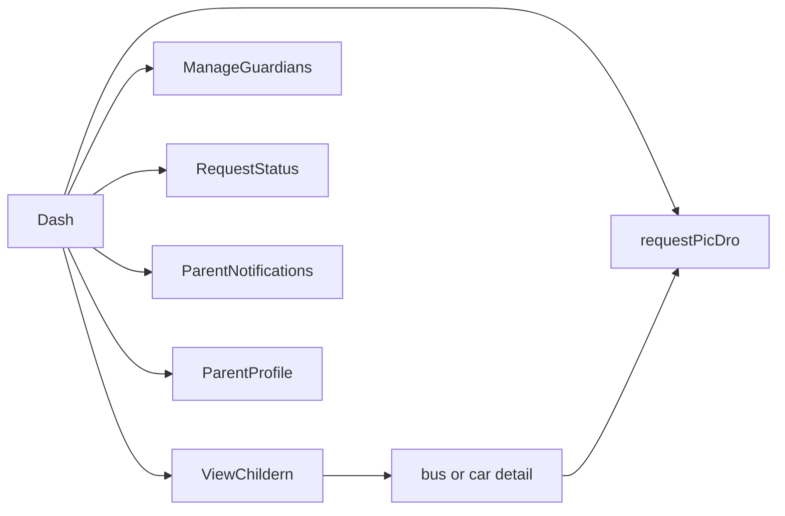
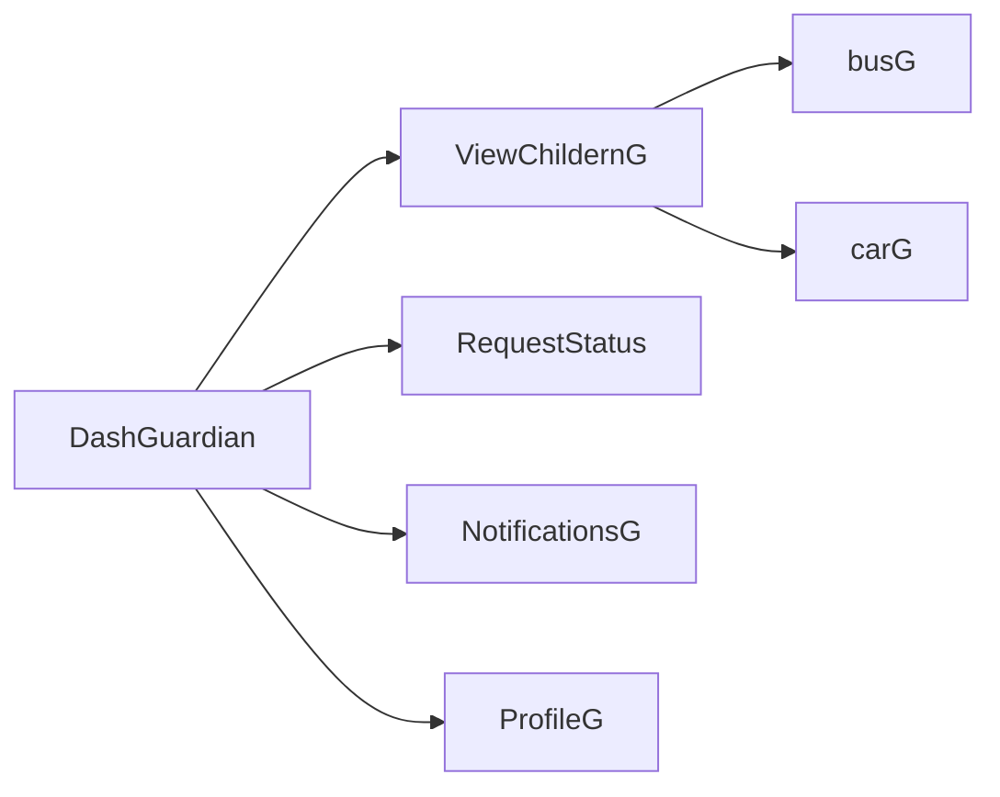
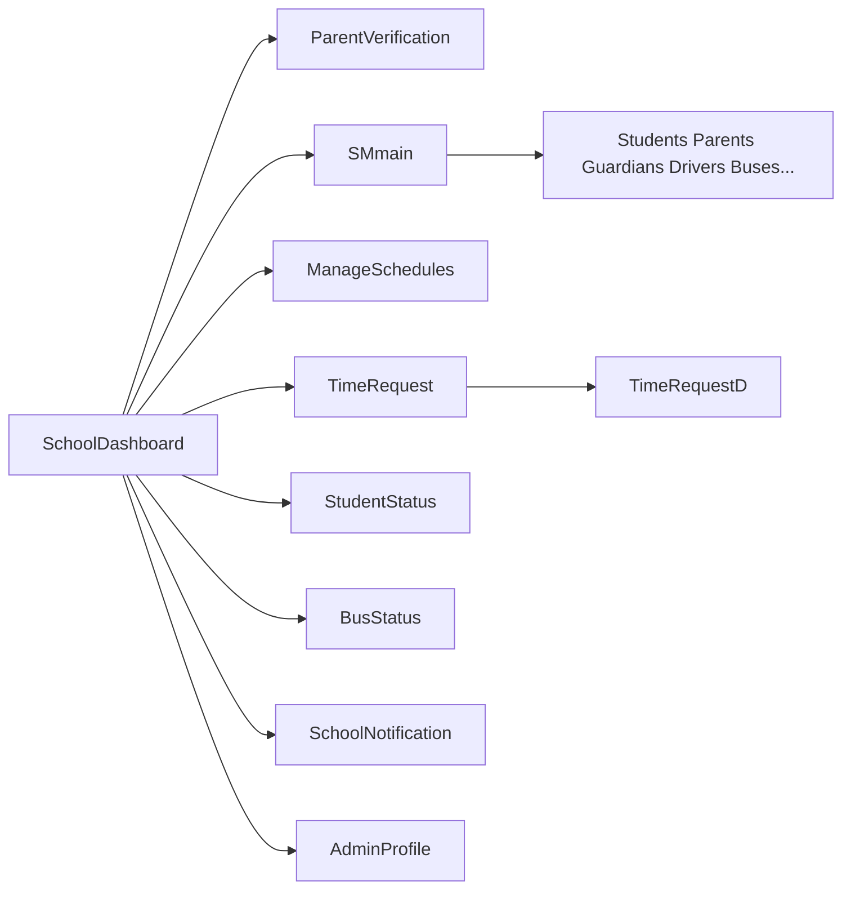
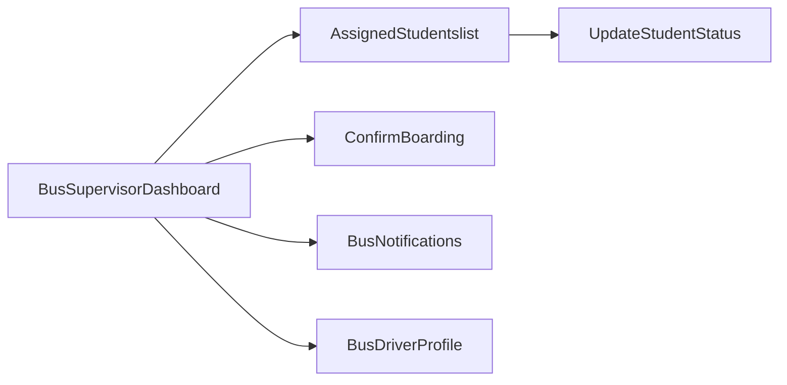

# GateFlow — Branch Documentation (UX, Navigation & Workflows)

This document describes how the **GateFlow** Flutter app behaves on this branch after the UX/navigation/refactor work. It is written so another human or an LLM can reason about **roles**, **routes**, **shared components**, **mock state**, and **primary user journeys** without opening every file.

---

## 1. Audience and scope

- **Audience**: Engineers, product reviewers, or AI assistants summarizing or extending the app.
- **Scope**: Flutter app under `test-4jcwyr/` (Dart/Flutter, GoRouter, Provider).
- **Out of scope**: Backend APIs, real authentication, production persistence. The app is **MVP-style** with **`MockState`** (`ChangeNotifier`) as the single source of in-memory “live” data for demos.

---

## 2. Product summary

**GateFlow** connects four personas around school pickup/drop-off and operations:

| Role | Purpose in the product |
|------|------------------------|
| **Parent** | Track children, manage authorized guardians, create pickup/drop-off style **requests**, see request status. |
| **Guardian** | View assigned children and transport context; does **not** create new requests in the current flows (read / track). |
| **School staff** | Operations hub: verify pickup, system management (students, parents, drivers, buses, guardians), schedules, time requests, live student/bus monitoring, notifications. |
| **Bus driver** | Daily run: see trip progress, student list, confirm boarding, update student status, profile/notifications. |

---

## 3. Technical architecture (high level)

```
┌─────────────────────────────────────────────────────────────┐
│  main.dart: ChangeNotifierProvider<MockState>               │
│  GoRouter (lib/flutter_flow/nav/nav.dart) — named routes  │
└─────────────────────────────────────────────────────────────┘
           │                              │
           ▼                              ▼
    RoleBottomNav                    Individual screens
    (reads MockState.currentUserRole)  pushNamed / goNamed
```

- **Routing**: **`GoRouter`** with **`FFRoute`** registrations in `lib/flutter_flow/nav/nav.dart`. Screens expose `static routeName` / `routePath` (FlutterFlow convention partially preserved).
- **Role selection**: Stored in **`MockState.currentUserRole`**. **`RoleBottomNav`** reads this and shows **different tab sets per role**.
- **Tab navigation**: `RoleBottomNav` uses **`context.goNamed(route)`** — it **replaces** the route stack for the primary destinations (avoid “infinite stack” between Home and Profile).
- **Detail / form flows**: Many screens still use **`context.pushNamed`** to open edit/detail pages; user returns with system back or AppBar back.

---

## 4. Application entry and “login” (mock)

### 4.1 Startup

1. **`/`** → `SplashWidget` → after ~1.4s → **`AuthenticationWidget`** (`goNamed(Authentication)`).

### 4.2 Authentication (role inference)

File: `lib/loginpages/authentication/authentication_widget.dart`

- User submits email/password (validation only; **no real auth**).
- **Role is inferred from email substring** (case-insensitive):

| Email contains | Role assigned |
|----------------|---------------|
| `school` or `admin` | `UserRole.schoolStaff` |
| `bus` or `driver` | `UserRole.busDriver` |
| `guardian` | `UserRole.guardian` |
| *(default)* | `UserRole.parent` |

- Then `MockState.loginAs(role)` and **`goNamed`** to the role home:

| Role | Initial route (`routeName`) |
|------|-----------------------------|
| Parent | `Dash` |
| School staff | `SchoolDashboard` |
| Bus driver | `BusSupervisorDashboard` |
| Guardian | `DashGuardian` |

### 4.3 Sign-out

- `lib/shared/sign_out_tile.dart`: after confirmation, **`loginAs(UserRole.none)`** then **`context.goNamed('Authentication')`**. With `UserRole.none`, **`RoleBottomNav` renders nothing** wherever it appears (empty list of items).

---

## 5. Global state: `MockState`

File: `lib/data/mock_state.dart`

### 5.1 Core enums

- **`UserRole`**: `parent`, `schoolStaff`, `busDriver`, `guardian`, `none`
- **`StudentStatus`**: `atHome`, `onBusToSchool`, `atSchool`, `onBusToHome`, `pickedUpByCar`
- **`RequestStatus`**: `pending`, `approved`, `rejected`
- **`BusStatus`**: `stationary`, `onRouteToSchool`, `onRouteToHome`

### 5.2 Entities (simplified)

- **`Student`**: id, name, grade, **mutable** `status`, optional `busId`
- **`Bus`**: id, name, driverId, **mutable** `status`
- **`ParentRequest`**: id, studentId, `type` (display string e.g. “Early Pickup”), **mutable** `status`, `date`

### 5.3 Default seed data (illustrative)

- **Students**: e.g. `s1` at school on bus `b1`, `s2` at home
- **Buses**: e.g. `b1` “Bus 12A - North Route”
- **Requests**: e.g. one **pending** “Early Pickup” for `s1`

### 5.4 Mutators (used by some flows)

- `updateStudentStatus(id, StudentStatus)`
- `updateRequestStatus(id, RequestStatus)`
- `updateBusStatus(id, BusStatus)`
- `loginAs(UserRole)`

Any widget using `context.watch<MockState>()` will rebuild when these change.

### 5.5 Limitations (important for LLMs)

- Child cards on **View Children** still use **local checkbox state** in `ViewChildernModel` / `ViewChildernGModel` — **not** synced to `MockState.students`.
- Dashboard “meta” lines (e.g. guardian name, pickup time on cards) may still be **static copy** where not yet bound to `MockState`.
- **Time Request** list content is **in-file fixture lists** in `TimeRequestWidget` (search/filter is real; data is not from `MockState`).

---

## 6. Bottom navigation contract: `RoleBottomNav`

File: `lib/shared/role_bottom_nav.dart`

Each **tab** maps to a **`routeName` string** that must exist in `nav.dart`.

### 6.1 Parent (`UserRole.parent`)

| Tab id | Label | `routeName` |
|--------|-------|-------------|
| `home` | Home | `Dash` |
| `children` | Children | `ViewChildern` |
| `requests` | Requests | `RequestStatus` |
| `profile` | Profile | `ParentProfile` |

### 6.2 Guardian (`UserRole.guardian`)

| Tab id | Label | `routeName` |
|--------|-------|-------------|
| `home` | Home | `DashGuardian` |
| `children` | Children | `ViewChildernG` |
| `profile` | Profile | `ProfileG` |

Note: **No dedicated “Requests” tab** for guardian; **Requests** is reachable from the guardian dashboard quick actions / latest request card (`RequestStatus`).

### 6.3 Bus driver (`UserRole.busDriver`)

| Tab id | Label | `routeName` |
|--------|-------|-------------|
| `home` | Home | `BusSupervisorDashboard` |
| `students` | Students | `AssignedStudentslist` |
| `profile` | Profile | `BusDriverProfile` |

### 6.4 School staff (`UserRole.schoolStaff`)

| Tab id | Label | `routeName` |
|--------|-------|-------------|
| `home` | Home | `SchoolDashboard` |
| `monitor` | Monitor | `StudentStatus` |
| `requests` | Requests | `TimeRequest` |
| `profile` | Profile | `AdminProfile` |

### 6.5 Implementation detail

- **`current`**: string id passed by each screen (`'home'`, `'children'`, etc.) to highlight the active tab.
- Uses **`goNamed`**: switching tabs **does not** preserve a deep stack under the previous tab (by design for MVP clarity).

---

## 7. Major branch changes (what was refactored)

### 7.1 Design system

- **`lib/shared/gateflow_colors.dart`**: Central palette (`brandPrimary`, surfaces, semantic success/warning/danger, status backgrounds).
- Modern layouts repeatedly use: **gradient hero**, **white cards**, **soft shadow**, **Outfit/Inter** via `google_fonts`.

### 7.2 New / important shared widgets

| File | Role |
|------|------|
| `shared/child_card.dart` | `ChildCard` + `ChildTransport` enum — child list row with attendance chips and `onTap` routing by bus vs car. |
| `shared/role_bottom_nav.dart` | Role-aware bottom bar (see §6). |
| `shared/status_pill.dart` | Tone-aware status badge (used where integrated). |
| `shared/empty_state.dart` | Reusable empty list UI. |
| `shared/gateflow_app_bar.dart` | Consistent AppBar pattern (available for screens not yet migrated). |
| `shared/sign_out_tile.dart` | Sign-out + `UserRole.none`. |

### 7.3 Screens substantially rewritten (behavior + layout)

- **Parent**: `lib/parent_new/dash/dash_widget.dart` — hero, “New Request” CTA, quick actions grid, latest request from `MockState`.
- **Guardian**: `lib/guardian/dash_guardian/dash_guardian_widget.dart` — parallel structure; uses `ProfileGWidget.routeName` for profile routes.
- **School**: `lib/school_pages/school_dashboard/school_dashboard_widget.dart` — stats from `MockState`, verify CTA, management grid.
- **Bus driver**: `lib/bus_pages/bus_supervisor_dashboard/bus_supervisor_dashboard_widget.dart` — stats + trip progress from `MockState`, CTA to assigned students list.
- **Parent children**: `lib/parent_new/view_childern/view_childern_widget.dart` — data-driven list; tap → `BusWidget` / `CarWidget` by transport.
- **Guardian children**: `lib/guardian/view_childern_g/view_childern_g_widget.dart` — same; tap → `BusGWidget` / `CarGWidget`.
- **School time requests**: `lib/school_pages/time_request/time_request_widget.dart` — tabbed Early/Late, **search**, shared row widget, tap → `TimeRequestD`.

### 7.4 Navigation wiring (ongoing pattern elsewhere)

Many **list/hub** pages wrap rows in **`InkWell`** and call **`context.pushNamed(...)`** to reach add/edit/detail routes (e.g. system management subtree, bus status → detail, student status → detail). The **router** remains the single registry of valid names in `nav.dart`.

---

## 8. Use cases and workflows (by role)

The following are **intended user journeys** as implemented in the MVP. Arrows show typical navigation; exact strings are **GoRouter `routeName`** values unless noted.

### 8.1 Parent



- **Home (`Dash`)**: Overview, pending request count from `MockState`, **New Request** → `requestPicDro`, quick actions to children / guardians / requests / notifications.
- **Children (`ViewChildern`)**: Cards per child; **transport badge**; **attendance chips** (local state); **tap card** → `bus` or `car` parent detail screen by mode.
- **Guardians**: `ManageGuardians` and related guardian-info flows (legacy pages may still exist in `index.dart` / `nav.dart`).
- **Requests**: `RequestStatus` lists/history (existing screen); dashboard “latest” deep-links here.

### 8.2 Guardian



- **Home**: Similar card layout to parent but **no** “create request” primary CTA; emphasis on tracking + reading request state.
- **Children**: Same `ChildCard` UX; routes to **guardian** bus/car pages (`busG`, `carG`), not parent’s `bus`/`car`.

### 8.3 School staff



- **Home (`SchoolDashboard`)**: Live **counts** (students at school / on bus / home) and **pending requests** from `MockState`; **Verify Pickup** → `ParentVerification`; grid entries → major modules.
- **Monitor tab**: Defaults to **student status** list; items typically push **detail** routes (e.g. bus vs car variants — check `StudentStatus` implementation).
- **Requests tab**: **Early/Late** with search; row tap → **`TimeRequestD`**.
- **System management (`SMmain`)**: Hub tiles → student/parent/guardian/driver/bus management lists and forms (many routes under `school_pages/system_management/...`).

### 8.4 Bus driver



- **Home**: Trip **progress bar** derives from **`MockState` student statuses** (ratio of dropped-off–like vs total); primary CTA **View Student List** → `AssignedStudentslist`.
- **Students tab**: Same assigned list route.
- **Row tap** on assigned students → **status update** flow (`UpdateStudentStatus`).

---

## 9. Navigation cheat sheet (`pushNamed` vs `goNamed`)

| Mechanism | Typical use |
|-----------|--------------|
| `context.goNamed` | Bottom nav destinations, switching “root” tabs, post-login landing. |
| `context.pushNamed` | Drill-ins: edit forms, detail pages, modal-style next steps preserved on stack. |
| `context.safePop` | Back from pushed routes. |

**LLM guidance**: Adding a **new primary tab** requires editing **`RoleBottomNav._itemsForRole`**, ensuring **`nav.dart`** registers the **`routeName`**, and passing the correct **`current`** id into `RoleBottomNav` on that screen.

---

## 10. File map (quick reference)

| Area | Path |
|------|------|
| App entry | `lib/main.dart` |
| Router | `lib/flutter_flow/nav/nav.dart` |
| Mock state | `lib/data/mock_state.dart` |
| Login / role routing | `lib/loginpages/authentication/authentication_widget.dart` |
| Shared UI | `lib/shared/*.dart` |
| Parent app | `lib/parent_new/**` |
| Guardian app | `lib/guardian/**` |
| School app | `lib/school_pages/**` |
| Bus app | `lib/bus_pages/**` |
| Exports barrel | `lib/index.dart` |

---

## 11. Known inconsistencies / future work hints

Useful for assistants planning next PRs:

1. **Mixed patterns**: Some screens still use FlutterFlow-heavy styling; dashboards and key hubs were modernized first.
2. **String route names**: Some calls use raw strings (`'SchoolNotification'`, `'TimeRequestD'`) vs `Widget.routeName` constants — functional but brittle; normalization would help grep/refactor safety.
3. **Data centralization**: Move time-request fixtures into `MockState` if you want school actions to mutate the same list parents see.
4. **Guardian requests tab**: Product decision whether guardians get a fourth tab or keep requests only from dashboard.

---

## 12. How to onboard ChatGPT / another assistant on this branch

Provide:

1. This file: `docs/GATEFLOW_BRANCH_DOCUMENTATION.md`
2. The single question: **“Role is inferred in `authentication_widget.dart`; nav is in `nav.dart`; tabs in `role_bottom_nav.dart`; state in `mock_state.dart`.”**
3. For a **specific bug**, cite the **`routeName`** from the widget file and verify it appears in **`nav.dart`**.

---

*Generated to document the GateFlow MVP Flutter branch UX/navigation refactor. Update this file when you add APIs, rename routes, or change role tab sets.*
