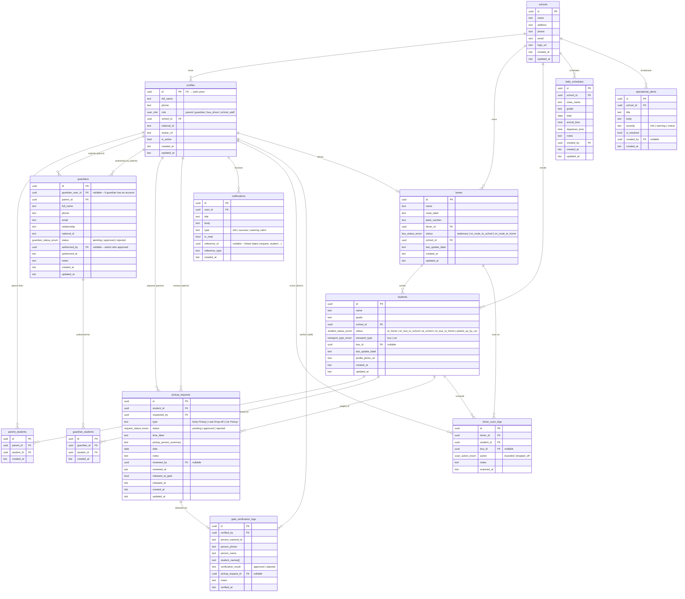

# GateFlow · Database Entity Relationship Diagram

## ERD (Mermaid)

---

## Table Descriptions

| Table | Role | Key Relationships |
|---|---|---|
| `schools` | Root tenant — every other record belongs to a school | All entities FK here |
| `profiles` | All users (parent / guardian / driver / staff). Auto-created by DB trigger on auth signup | FK to `schools`, drives `parent_students`, `guardians`, `buses` |
| `buses` | Fleet record with live status | FK to `profiles` (driver), `schools` |
| `students` | Student roster with real-time transport status | FK to `schools`, `buses` |
| `parent_students` | Many-to-many: a parent can have multiple children; a child can have multiple parents | Links `profiles` ↔ `students` |
| `guardians` | Guardian invite submitted by parent, approved by school admin | FK to `profiles` (parent, guardian_user, authorized_by) |
| `guardian_students` | Which students each approved guardian may pick up | Links `guardians` ↔ `students` |
| `pickup_requests` | Early-pickup / late-dropoff / car-pickup requests | FK to `students`, `profiles` (requester, reviewer) |
| `daily_schedules` | Per-class daily schedule entries created by admin | FK to `schools`, `profiles` (creator) |
| `notifications` | Per-user notification inbox; broadcast via `broadcast_school_notification()` | FK to `profiles` |
| `operational_alerts` | Staff bulletins visible to all school staff / drivers | FK to `schools`, `profiles` (creator) |
| `driver_scan_logs` | Immutable audit trail — every QR/manual scan recorded | FK to `profiles`, `students`, `buses` |
| `gate_verification_logs` | Every gate check (national ID or phone lookup) recorded | FK to `profiles`, `pickup_requests` |

---

## Enum Types

| Enum | Values |
|---|---|
| `user_role` | `parent` · `guardian` · `bus_driver` · `school_staff` |
| `student_status_enum` | `at_home` · `on_bus_to_school` · `at_school` · `on_bus_to_home` · `picked_up_by_car` |
| `bus_status_enum` | `stationary` · `on_route_to_school` · `on_route_to_home` |
| `request_status_enum` | `pending` · `approved` · `rejected` |
| `transport_type_enum` | `bus` · `car` |
| `guardian_status_enum` | `pending` · `approved` · `rejected` |
| `scan_action_enum` | `boarded` · `dropped_off` |

---

## Key DB Functions

| Function | Purpose |
|---|---|
| `fn_handle_new_user()` | Trigger on `auth.users` INSERT — auto-creates the `profiles` row from user metadata |
| `fn_updated_at()` | Trigger on every mutable table — keeps `updated_at` current |
| `broadcast_school_notification(school_id, title, body, type, roles[])` | Inserts a notification row for every active profile in the school matching the given roles |
| `my_school_id()` | Stable helper used by RLS policies — returns the calling user's `school_id` |
| `my_role()` | Stable helper used by RLS policies — returns the calling user's role enum |

---

## Row-Level Security Summary

| Table | Who can SELECT | Who can INSERT/UPDATE/DELETE |
|---|---|---|
| `profiles` | Own row + same school | Own row (update); staff (insert) |
| `students` | Own children (parent) + same school (staff/driver) | School staff (all); driver (status update only) |
| `buses` | Same school | School staff |
| `parent_students` | Own links | School staff |
| `guardians` | Own (parent) + school (staff) | Parent (own); school staff (approve/reject) |
| `guardian_students` | Guardian (own) / staff / parent | Staff + parent |
| `pickup_requests` | Own (parent) + school students (staff) | Parent (insert own); staff (update status) |
| `daily_schedules` | Same school | School staff |
| `notifications` | Own | Own |
| `operational_alerts` | Same school | School staff |
| `driver_scan_logs` | Own driver / same school buses | Driver (insert own) |
| `gate_verification_logs` | Own (verified_by) | Staff |
